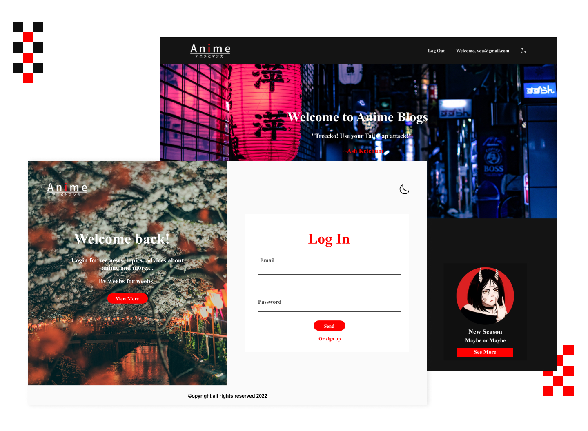

# Anime Blog with register
This is an anime blog, with uploaded images, blog, comments, dark mode and auth system with jwt
___


## Table of contents
___
  - [Features](#features)
   - [Built with](#built-with)
   - [Blog Api](#API)
   - [How to use the blog Api](#how-use-the-blog-api)
      - [Get All Blogs](#get-all-blogs)
      - [details blog](#details-blog)
      - [Post a blog](#post-a-blog)
      - [Update a blog](#update-a-blog)
      - [Post a comment](#post-a-comment)
      - [Delete a blog](#delete-a-blog)
   - [Auth Api](#auth-api)
   - [Hosting](#hosting)

## Features

Users should be able to:

- Could Log In
- Could Sign Up
- could log Out
- Switch on dark mode o normal mode theme
- The user just has to sign up one time and then just log in, at least the user wants to make another user
- If the user log in, the user don't have to log in again until 3 days after, at least that he log out
- If the user **has been registering** already could :
    - See all blogs 
    - See random Quotes
    - See blog details
    - Post comments on the blog
    - Post and create blogs
- If the user is the owner of the blog could:
    - Edit the Blog
    - Delete the Blog

## Built with
___

 - [NodeJs](https://nodejs.org/en) - NodeJS
 - [Ejs](https://ejs.co) - NodeJs Template
 - [Multer](https://www.npmjs.com/package/multer) - NodeJs Midleware for handle Multiparty
 - [Validator](https://www.npmjs.com/package/validator) - NodeJs Validator 
 - [Cookie-parser](https://www.npmjs.com/package/cookie-parser) Handle cookies on NodeJs
 - [Bcrypt](https://www.npmjs.com/package/bcrypt) - Safely Store password
 - [jsonwebtoken](https://www.npmjs.com/package/jsonwebtoken) - Create Tokens
 - [MongoDb](https://www.mongodb.com/) - MongoDb
 - [Mongoose](https://mongoosejs.com/) - Object Modeling for nodeJs
 - [ExpressJs](https://expressjs.com/) - NodeJs Framework

## Blog Api
___

This api provides blogs and comments that user has already created or posted

main route :
>  https://blog-anime-node.herokuapp.com/blogs

> These examples exclude the view template EJS by default and auth middleware also you have to be a login already to get all these data.
 **This is just a guide that things you could expect to get from API that exclude the view template**

### Get All Blogs
___
>  https://blog-anime-node.herokuapp.com/blogs

### example request

```javascript

    fetch('https://blog-anime-node.herokuapp.com/blogs')
    .then(request => request.json())
    .then(data => console.log(data))
    .catch(err => console.log(err.message))

```


### Example response

```json 
 [
    {
        "title":"aaaa",
        "body":"eeee",
        "user:":"email.com",
        "filename":"esss",
        "content-type":"esss",
        "imageBased64":"esoo",
        "comments":["esoo"],
        "email":["user@gmail.com"]

    }
 ]
```

### Details Blog
___
>  https://blog-anime-node.herokuapp.com/blogs/**id**

the **id** : blog_id

### example request

```javascript

    fetch(`https://blog-anime-node.herokuapp.com/blogs/${id}`)
    .then(request => request.json())
    .then(data => console.log(data))
    .catch(err => console.log(err.message))

```

### Example response

```json 
 [
    {
        "title":"aaaa",
        "body":"eeee",
        "user:":"email.com",
        "filename":"esss",
        "content-type":"esss",
        "imageBased64":"esoo",
        "comments":["esoo"],
        "email":["user@gmail.com"]

    }
 ]
```

### Post a blog
___
>  https://blog-anime-node.herokuapp.com/blogs

### example request

```javascript

     const formData = new FormData(this)

    fetch('https://blog-anime-node.herokuapp.com/blogs', {
        method:"POST",
        body:formData,
    })
     .then(request => request.json())
     .then(data => console.log(data))
      .catch(err => console.log(err.message))

```

### example response - success

```json
    [
        {
            "newBlog":"SADFASDASD",
            "location":"/blogs/newBlog"
        }
    ]
```

> newBlog means the id of the new blog
> the location, it's the route for details of the blog

### example response - unsuccessfull

```json
    [
        {
            "errors":{
                "title":"",
                "body":""
            }
        }
    ]
```

> These errors are based on mongoose handle Errors

### Update a blog
___
>  https://blog-anime-node.herokuapp.com/blogs/update/**id**

### example request

```javascript

     const formData = new FormData(this)
      const id = blog._id

    fetch(`https://blog-anime-node.herokuapp.com/blogs/update/${id}`, {
        method:"PUT",
        body:formData,
    })
     .then(request => request.json())
     .then(data => console.log(data))
      .catch(err => console.log(err.message))
```

### example response - unsuccessfull

```json
    [
         
        {
            "errors":{
                "title":"",
                "body":""
            }
        }
    
    ]
```

The location, it's the route for details of the old blog

### Example response - successfull

```json
    [
        {
            "state":"update",
            "location":"/blogs/id_old_blog"
        }
    ]
```

The location, it's the route for details of the old blog

### Post a comment 
For the comment actually, the blog is updated
>  https://blog-anime-node.herokuapp.com/blogs/comments/**id**

### example request

```javascript

    const {email, comment} = form
    const id = blog._id

    fetch(`https://blog-anime-node.herokuapp.com/blogs/update/${id}`, {
           method:"PUT",
           headers:{"Content-Type":"application/json"},
           body:JSON.stringify({ email, comment }),
    })
     .then(request => request.json())
      .then(data => console.log(data))
      .catch(err => console.log(err.message))
```

### Example response - successfull

```json
    [
        {
            "state":"Successfull",
            "location":"/blogs/id_old_blog"
        }
    ]
```

### Delete a Blog
___
>  https://blog-anime-node.herokuapp.com/blogs/id

### Example request

```javascript

    const id = blog._id

    fetch(`blogs/${id}`, {
        method:"DELETE",
    })
     .then(request => request.json())
     .then(data => console.log(data))
      .catch(err => console.log(err.message))
```

### Example response - successfull

```json
    [
        {
            "state":"delete",
            "location":"/blogs"
        }
    ]
```
### example response - unsuccessfull

```json
    [
         
        {
            "errors":"try again"
        }
    
    ]
```

### Auth Api 

The API for auth is for registering new users on the database and login with cookies

### Hosting

The app is hosting on Heroku so kind of slow because you have to pay for dynos and I can't pay


